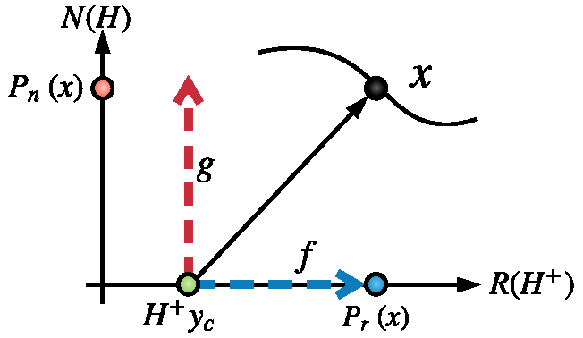
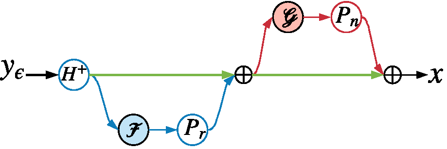

# Deep Decomposition Network (DDN) for inverse imaging problems
This is the implementation of ECCV'20 paper:

[Deep Decomposition Network for Inverse Imaging Problems](https://arxiv.org/abs/1911.11028). 

By [Dongdong Chen](http://dongdongchen.com), [Mike E. Davies](https://scholar.google.co.uk/citations?user=dwmfR3oAAAAJ&hl=en).

The University of Edinburgh, UK.

### Table of Contents
0. [Keywords](#Keywords)
0. [Abstract](#Abstract)
0. [Motivation](#Motivation)
0. [Requirement](#Requirement)
0. [Usage](#Usage)
0. [Citation](#citation)

### Keywords

Inverse problem, Deep learning, Physics consistence, Range-Nullspace decomposition 

### Abstract
Deep learning is emerging as a new paradigm for solving inverse imaging problems. However, the deep learning methods often lack the assurance of traditional physics-based methods due to the lack of physical information considerations in neural network training and deploying. The appropriate supervision and explicit calibration by the information of the physic model can enhance the neural network learning and its practical performance. In this paper, inspired by the geometry that data can be decomposed by two components from the null-space of the forward operator and the range space of its pseudo-inverse, we train neural networks to learn the two components and therefore learn the decomposition, i.e.,  we explicitly reformulate the neural network layers as learning range-nullspace decomposition functions with reference to the layer inputs, instead of learning unreferenced functions. We empirically show that the proposed framework demonstrates superior performance over recent deep residual learning, unrolled learning and nullspace learning on tasks including compressed sensing medical imaging and natural image super-resolution.

### Motivation

Inverse problem:


range-nullspace decomposition of data:


illustration:



deep decomposition network (DDN) using cascade architecture



performance in the super-resolution (SR, 2x noise_sigma=0.1) task


### Requirement
0. PyTorch >=1.0
0. CUDA >=8.5

### Usage
0. download [trained model](https://drive.google.com/file/d/1tTAcxAlA3ZIvEKUv5x1Qd9XJy4sLHp24/view) used in the SR examples.
0. run [sr_test.py](https://github.com/edongdongchen/DDN/blob/master/sr_test.py) for the SR examples
0. the neura network architecture of DDN is defined in [network_arch.py](https://github.com/edongdongchen/DDN/blob/master/network_arch.py)
0. the forward and pseudo-inverse operators are implemented in [operators.py](https://github.com/edongdongchen/DDN/blob/master/operators.py)
0. note: the Magnetic Resonance Fingerprinting (MRF) data was from a partner company and we are restricted from sharing. Users need to specify their own dataset. Our code can be flexibly transferred or directly used on other customized MRF dataset. Please refer the forward/adjoint operators for MRF dataset in [another our project](https://github.com/edongdongchen/PGD-Net/blob/master/operators.py).

### Example
```
python sr_test.py
```
to produce the reconstruction, recovered range component, nullspace component.


### Citation

If you used our method/code in your research, please cite:

	@inproceedings{chen2020decomposition,
		author = {Chen, Dongdong and Davies, Mike E},
		title = {Deep Decomposition Learning for Inverse Imaging Problems},
		booktitle={Proceedings of the European Conference on Computer Vision (ECCV)},
		year = {2020}
	}
